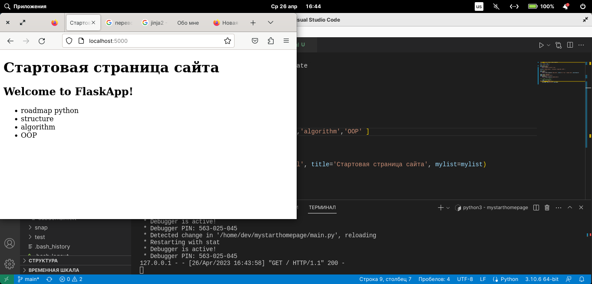
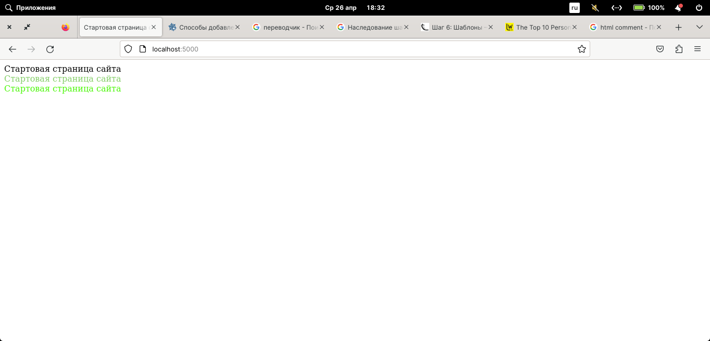
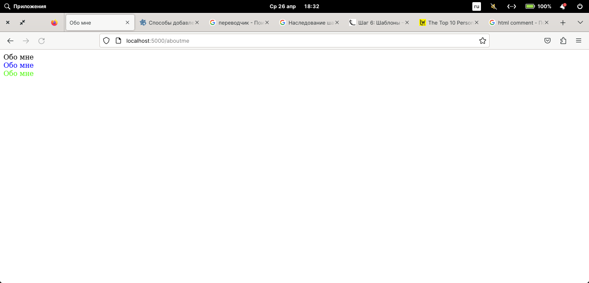

# Ввведение в Flask
. venv/bin/activate 
flask --app main run --debug

jinga2

Перейдите в каталог с проектом 

> если нет python, установим
`apt install python3.10-venv`

Создадим вируальную среду окружения, для того чтобы все требуемые пакеты устанавливались именно в нее, а не глобально
`python3 -m venv venv`

Активируем виртуальную среду. Об активации говорит префикс в начале строки (venv)
```bash
xub@xub:~/mystarthomepage$ . venv/bin/activate
(venv) xub@xub:~/mystarthomepage$ 
```
Для деактивации используется команда `deactivate`
```console
(venv) xub@xub:~/mystarthomepage$ deactivate
xub@xub:~/mystarthomepage$
```
Установим Flask
`pip install Flask`

Проверим установку
```console
(venv) xub@xub:~/mystarthomepage$ flask --version
Python 3.10.6
Flask 2.2.3
Werkzeug 2.2.3
```
> Werkzeug библиотека взаимодействия между python и веб сервером

Cоздадим файл .gitignore и добавим сгенерированные файлы, чтобы не тащить их в удаленный репозиторий
```
venv
__pycache__
```

В таком случае после добавления в удаленный репозиторий и извлечения проекта на другом хосте потребуется заного устанавливать зависимости.
Чтобы бысто их установить при извлечении из удаленного репозитория. Создадим файл со всеми зависимстями установленными в локальном окружении ключ `-l`. 

`pip freeze -l > requirements.txt`

Для того чтобы установить все зависимости из файла выполним следующую команду

`pip install -r requirements.txt`

Создадим файл main.py, выводящий hello world на экран, со следующим содержимым.
```py
from flask import Flask

app = Flask(__name__)

@app.route("/")
def hello_world():
    return "<p>Hello, World!</p>"

if __name__ == '__main__':
    app.run()
```

В первой строке класс Flask импортируется из пакета flask.

Во второй строке создается объект Flask. Для этого конструктору Flask назначается аргумент __name__. Конструктор Flask должен иметь один обязательный аргумент. Им служит название пакета. В большинстве случаев значение __name__ подходит. Название пакета приложения используется фреймворком Flask, чтобы находить статические файлы, шаблоны и т.д.

Запустим сервер командой 
`flask --app main run`
`python main.py`
`python3 main.py`
```
 * Serving Flask app 'main'
 * Debug mode: off
WARNING: This is a development server. Do not use it in a production deployment. Use a production WSGI server instead.
 * Running on http://127.0.0.1:5000
Press CTRL+C to quit
```
Перейдем по адресу http://127.0.0.1:5000 и убедимся что все работает 

Для того чтобы выключить сервер нажмем комбинацию CTRL+C

При изменении кода проекта в данном режиме запуска сервера требуется его перезапуск. Для того чтобы исправить данное поведение запустим проект в режиме отладки.
`flask --app main run --debug`
Измените программный код и убедитесь, что сервер автоматически перезагружается.

Вывод будет следующий 
```bash
 * Serving Flask app 'main'
 * Debug mode: on
WARNING: This is a development server. Do not use it in a production deployment. Use a production WSGI server instead.
 * Running on http://127.0.0.1:5000
Press CTRL+C to quit
 * Restarting with stat
 * Debugger is active!
 * Debugger PIN: 112-274-532
```

Для выкладывания кода в продакшн замените соответствующие строки в основном файле на строки ниже и запустите `python file_name.py`
```py
if __name__ == "__main__":
    from waitress import serve
    serve(app, host="0.0.0.0", port=8080)
```

*Практические задания*
0. Установите python и pip3 на вашу ОС. Создайте каталог для приложения Flask. Перейдите в него и создайте виртуальное окружение. 
1. Установите Flask в виртуальное окружение.
2. Создайте файл для первоначального запуска приложения Flask.
3. Запустите сервер и проверьте его работоспособность.
4. Создайте файл requirements.txt
5. Запустите сервер в режиме отладки.

# Шаблоны в Flask, введение в jinja2

Для использования шаблонов испортируем модуль `render_template`.
Соответственно первая строчка основного файла, в качестве примера использовался main.py. Будет выглядеть следующим образои
`from flask import Flask, render_template`

Импортируемый модуль позволяет добавлять HTML файлы в качестве страниц через декоратор `route`.
Создадим два перенаправления страниц в основном файле. Первая будет главной страницей, а вторая обо мне.
```py
@app.route('/')
def index():
    return render_template('index.html')

@app.route('/aboutme')
def aboutme():
    return render_template('aboutme.html')
```
В нашем случае появились два дополнительных файла index.html и aboutme.html. По умолчанию данные файлы храняться в каталоге `templates`, который находится в одной каталоге с основным файлом в нашем случае `main.py`.

Также существует возможность сделать несколько роутеров на одну html страницу.
```py
@app.route('/aboutme')
@app.route('/business_card')
```

Главная страница сайта выглядит самым простым образом.
```html
<!DOCTYPE html>
<head>
    <title>FlaskApp</title>
</head>
<body>
    <h1>Hello World!</h1>
    <h2>Welcome to FlaskApp!</h2>
</body>
</html>
```

Мы научились создавать шаблоты, передавать браузеру.
Рассмотрим вопрос как передавать параметры внуть шаблона.

При помощи фаблонов мы можем передавать информацию внутрь html документа.
Добавим параметр `title`, который мы хотим передать. Для этого используем номатицию *jinja2*, который представляет собой инструмент для html-шаблонизации. Более подробно его функцкиональность рассотрим на следующих практических занятиях

Файл main.py будет выглядеть следующим образом

```py
@app.route('/')
def index():
    return render_template('index.html', title='Стартовая страница сайта')
```

А в index.html заменим текст на шаблон *jinja2* `{{title}}`, который передаст параметр в html. 
```html
<!DOCTYPE html>
<head>
    <title>{{title}}</title>
</head>
<body>
    <h1>{{title}}</h1>
    <h2>Welcome to FlaskApp!</h2>
</body>
</html>

Расмотрим простой пример *jinja2* с циклом for для добавления HTML списка.
Добавим список в main.py и новый параметр mylist.

```python
mylist=['roadmap python', 'structure','algorithm','OOP' ]

@app.route('/')
def index():
    return render_template('index.html', title='Стартовая страница сайта', mylist=mylist)
```

Изменим html согласно спецификации *jinja2*.
```html
<!DOCTYPE html>
<head>
    <title>{{title}}</title>
</head>
<body>
    <h1>{{title}}</h1>
    <h2>Welcome to FlaskApp!</h2>
    <ul>

<li>{{x}}</li>

    </ul>
</body>
</html>
```


ФОТО1 IMAGE_README

#### Наследование шаблонов

Наследование шаблонов позволяет создать главный шаблон и после его определения, добавлять его во все html файлы, наследуя структу полностью или частично с учетом возможности редактирования. 

Создадим базовый шаблон, который будет содержать шапку и подвал, основное окно сайта, в которой будет две панели одна слева, другая справа. Назовем его base.html.

Пошагово соберем подобный шаблон и для того чтобы отличать страницы добовим параметр title в роутер страницы aboutme.

```
@app.route('/aboutme')
def aboutme():
    return render_template('aboutme.html', title='Обо мне')
```

Приведем базовый шаблок к разделению на шапку подвал и контент.
```html
<!DOCTYPE html>
<head>
 
    <title>{{title}}</title>

</head>
<body>
    <header>
         
    <div>{{title}}</div>
        
    </header>
    <div>
         
        <div>{{title}}</div>
        
    <div>
    <footer>
         
        <div>{{title}}</header>
        
    </footer>
</body>
</html>
```

Для переиспользования шаблона base.html изменим index.html и aboutme.html. Данные файлы будут состоять только из одной строчки. И проверим работоспособность. Если все правильно получилось базовый шаблон должен подтянуться к остальным документам.

```jinja2

````

Установим фоновый цвет в тегах базового шаблона и переопределим цвет текста в дочерних документах.
base.html приведем к виду.
```html
<!DOCTYPE html>
<head>
 
    <title>{{title}}</title>

</head>
<body>
    <header>
         
        <div style="color: #030303">{{title}}</div>
        
    </header>
    <div>
         
        <div style="color: #0400fc">{{title}}</div>
        
    <div>
    <footer>
         
        <div style="color: #4af706">{{title}}</div>
        
    </footer>
</body>
</html>
```

index.html будет выглядеть следующим образом
```html

 
<div style="color: #83cd66">{{title}}</div>

```
Как мы видим aboutme.html унаследовал все от базового шаблона, а поведение index.html мы изменили.

 


При помощи функции супер мы можем дописать наследовать шаблон и добавить новые теги

```html


{{super()}}
<div style="color: #83cd66">{{title}}</div>

```
### Статические файлы

Для добавления статических файлов CSS, JS, изображений. Создадим каталог static, который должен находиться на одном уровне вложенности с файломо main.py, каталогом templates и др.

Добавим изображение при помощи функции url_for в файл index.html.

```html

```

Добавление CSS добавление JS
Для добавления создадим каталог CSS и JS в static. Добавим два файла main.css и main.js
CSS.

Подключим CSS, добавив строчку в тег `head`.
```html
<link rel="stylesheet" href="{{ url_for('static', filename='css/main.css') }}">
```
Изменим тег `header` добавив следующее содержимое.
```html
    <header>
        
        <div class="container">
            <h1 class="logo">Ardit's web app</h1>
            <strong><nav>
              <ul class="menu">
                <li><a href="{{ url_for('index') }}">Home</a></li>
                <li><a href="{{ url_for('aboutme') }}">About</a></li>
              </ul>
            </nav></strong>
          </div> 
        <div style="color: #030303">{{title}}</div>
        
    </header>
```

> Следует отметить, что ссылки на страницы можно создать при помощи *jinja2* `{{ url_for('index') }}`, где index название html файла без расширения.

Подключим JS, добавив строчку в тег `head`.

Добавим в тег `head` скрипт для подключения статического файла js.

```js
<script src="{{ url_for('static', filename='js/main.js') }}"></script>
```

В `base.html` добавим строки, которые позводяют добавить html строку при нажатии на книпку
```html
   <h1 id="demo">test</h1>
   <button type="button" onclick="myFunction()">Попробовать</button>
```

Добавим в содержимое файла main.js функцию обработчик.

```js
function myFunction() {
  document.getElementById("demo").innerHTML = "Параграф изменен.";
}
```

*Практические задания*
1. Cоздайте стартовую страницу (произвольного содержания). Добавьте шаблон в основной файл flask приложения.
2. Добавьте парамент content, который кратко будет характеризовать контейнт проекта. Добавьте параметр в index.html.
3. Создайте html страницу в которой будут находиться контакты с владельцем сайта.
4. Добавьте в нее тот же параметр, который ранее был добавлен на страницу index.html
5. Создайте базовый шаблон и добавьте его на все страницы, дополните произвольным содержимым страницу с контактами.
6. Добаьте статические файлы css и js. Произвольную фотографию на страницу index.html и favicon.
7. Добавьте стили Bootstrap и замениме header произвольными компонентами.

Дополнительное практическое задание

1. Замените Bootstrap на Tailwind и убедитесь что все компоненты работают.

### jinja2

boilerplat
https://www.fullstackpython.com/
https://www.fullstackpython.com/flask.html
